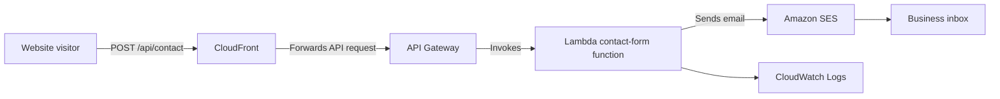

# Contact form architecture

The NextFoundry contact form sends messages through a serverless AWS service.
This keeps AWS credentials out of the browser and avoids managing a dedicated
web server.

## Architecture

## Why Lambda

Lambda is used for the form processing because it:

- Runs only when a visitor submits the form.
- Does not require a server to be maintained or patched.
- Scales automatically for occasional bursts of traffic.
- Keeps email-sending permissions on the server side instead of in the website.

## What each service does

| Service | Responsibility |
| --- | --- |
| CloudFront | Delivers the website and forwards `/api/contact` requests to API Gateway. |
| API Gateway | Provides the public HTTP endpoint and limits requests to protect the backend. |
| Lambda | Validates the submitted fields and sends the email. |
| Amazon SES | Delivers the email from the verified sender address. |
| CloudWatch Logs | Stores Lambda operational logs for troubleshooting. |

## Security controls

- The browser has no AWS credentials.
- Lambda validates the name, email address, and message length.
- A hidden honeypot field helps discard basic bot submissions.
- API Gateway throttles requests.
- Lambda has an IAM role with only the permissions needed to write logs and send email.
- Internal AWS errors are not returned to website visitors.

## Deployment

Terraform defines the AWS resources in `infra/contact-form.tf`.
GitHub Actions builds the website, runs the dependency audit, and applies the
Terraform configuration when changes are pushed to `main`.
